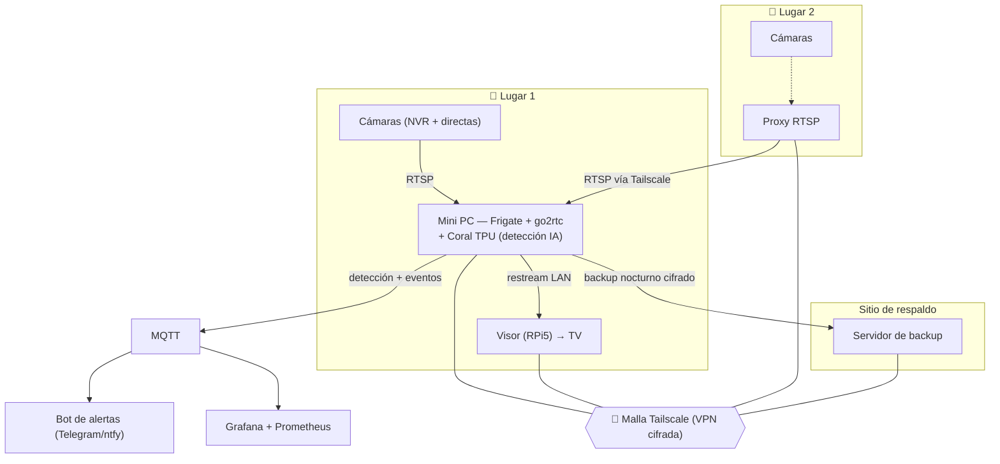

# Diagrama de infraestructura — Sistema de Videovigilancia Híbrido

> Vista conceptual de alto nivel. Para el detalle técnico completo (versiones de software,
> configuración) ver `docs/BIBLIA_PROYECTO.md`. Deliberadamente **no** se documentan aquí
> puertos, nombres de contenedores/servicios internos ni topología exacta de red — esto es
> una referencia de arquitectura, no un mapa de infraestructura desplegable tal cual.

## Vista general (Mermaid)

## Flujo de datos

1. **Cámaras → go2rtc**: go2rtc es el *único* consumidor RTSP de cada cámara (evita saturar
   cámaras baratas que no soportan múltiples conexiones simultáneas). Las de Lugar 1 se
   conectan directo; las de Lugar 2 llegan vía un proxy RTSP sobre Tailscale.
2. **go2rtc → Frigate + Coral**: detección de objetos (persona/auto/mascota) en tiempo real
   sobre un Coral USB TPU.
3. **Frigate → MQTT**: eventos disparan alertas por Telegram/ntfy y alimentan métricas
   (Prometheus/Grafana, contador de personas).
4. **go2rtc → visor**: el visor (RPi5) consume el restream por LAN — nunca toca las cámaras
   directamente, y sin credenciales embebidas.
5. **Backup**: respaldo nocturno cifrado hacia un tercer sitio independiente, que además
   actúa como tercer vértice del dead-man's-switch de resiliencia (ver README principal).

## Control / acceso

- Frigate (según versión) puede no exponer toggle vía REST API — se controla por MQTT.
- El watchdog de emergencia corre en el host (fuera del contenedor de detección) para
  sobrevivir a un colapso del stack de IA.
- Credenciales reales: nunca en este repo — solo en un archivo local gitignored.
